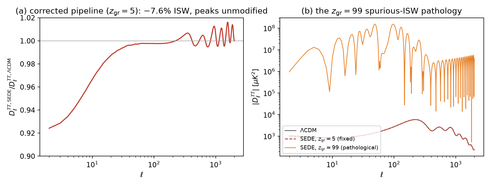
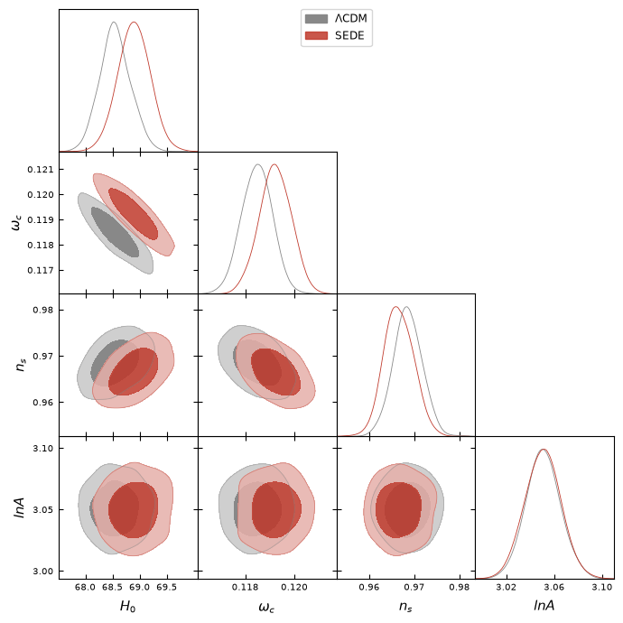
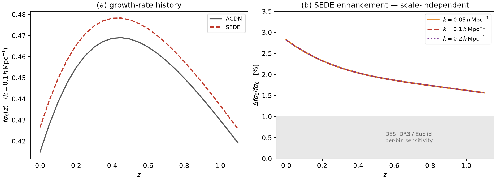

# Structural Entropy Dark Energy against DESI DR2, Pantheon+ and Planck 2018: a zero-extra-parameter test

**Stilian Pandev**

## Abstract

We confront Structural Entropy Dark Energy (SEDE) — a structure-gated, H-linear horizon-entropy dark
energy realized as a cubic kinetic-gravity-braiding theory with braiding fraction b = 0.20 — with the full
DESI DR2 BAO, Pantheon+ SN, and Planck 2018 (lowl TT + high-ℓ TTTEEE-lite) likelihoods, computed through
the mochi-class modified-gravity Boltzmann code inside cobaya. SEDE's background w(z) is fixed by its
reconstruction, so at the level of this comparison it carries the **same free-parameter count as ΛCDM**.
(This equal count is at the background/geometry level; the perturbation sector adds one *disclosed* parameter,
the braiding fraction b, registered as a pre-committed falsifier measurable at ∼5σ by DESI DR3 + Euclid — not
fit to the likelihoods driving this comparison.)
At the background level (BAO+SN+BBN) the two models are indistinguishable, Δχ² = −0.43. With the full
likelihoods, the best-fit comparison gives Δχ²(SEDE−ΛCDM) = −3.4, and converged MCMC chains give a
marginalized **ΔDIC = −3.5** — of which −3.0 is the mean-χ² difference and the remaining half-unit an
effective-complexity term inside the Monte-Carlo scatter. At equal parameter count SEDE is therefore
**statistically consistent with ΛCDM, with a mild same-direction pull** (ΔDIC ≈ −3.0, "positive but not
strong" evidence) residing entirely in the Planck high-ℓ likelihood, in the direction of Planck's mild
lensing-amplitude anomaly. Because that anomaly is itself partly a lite-likelihood systematic, we test the
pull directly against the Planck 2018 lensing (φφ) likelihood in a full BAO/SN/BBN-anchored joint refit
(φφ as a best-fit datum, separate from the DIC chains): it erodes the preference from −3.5 to −2.3,
consistent with about a third of the gain being the A_lens systematic rather than physical lensing — we
make no detection claim. This is the SH0ES-free, full-likelihood
counterpart of the compressed-CMB preference reported in the companion cosmology paper (there
ΔDIC ≈ −3.5 to −4.7, its upper end carried by the contested local-H₀ prior and the compression); the
independent full-likelihood test here lands at the conservative end, ΔDIC ≈ −3.0. En route we diagnose
and fix a numerical pathology of the stable-parametrization scalar
sector (a spurious late-time oscillation seeded at the GR$\to$EFT transition that mimics a large ISW signal),
and we validate the corrected pipeline exhaustively. SEDE's discriminating predictions survive intact and
are led by the one that does not depend on the solver regime: a **+2–3% scale-independent fσ8 enhancement**
through the RSD range — fixed by the sub-horizon coupling μ_∞ = 1.05, independent of the tachyonic-window
regularization, opposite in sign to what would ease the S₈ tension, and within DESI DR3/Euclid reach — with
a corroborating **−7.6% ISW suppression** at ℓ = 2 (computed below the window and correspondingly more
model-dependent). The pipeline is rerunnable from the released configurations and a pinned fork of the Boltzmann code
(the chain products and DIC-reduction script are to be committed with the release; see Reproducibility).

**Keywords —** dark energy theory; cosmological parameters from CMBR; baryon acoustic oscillations; modified gravity.

## 1. Introduction

SEDE posits that dark energy is the thermodynamic response of the cosmic horizon with a volume-law
("Barrow Δ = 1") entropy, activated by the formation of cosmic structure through a saturation gate
f_sat(σ_R²). Its background history is not a fitted w₀–w_a curve: given the gate and the entropy law, w(z)
is produced by a fixed-point reconstruction (FPAB) whose output — a cubic KGB theory in the stable
parametrization (ΔM*², D_kin, c_s²), with braiding α_B = b·Ω_X and b = 0.20 (the adopted value; the
QCD-derived braiding fraction is b ≈ 0.206) — is then frozen. The model
therefore enters a likelihood comparison with **zero extra continuous background parameters** relative to
ΛCDM; its dark-energy sector is either right or wrong as a shape.

The companion cosmology paper [@Pandev:2026cosmology] reports the same mild preference from compressed CMB
distance priors combined with a local-H₀ prior (ΔDIC ≈ −3.5 to −4.7, the upper end carried by the
contested SH0ES prior and the compression). Compressed priors plus a local-H₀ prior are a weaker
foundation than the real likelihoods; the purpose of this paper is to make the test as strong as we can — the
same question, asked of the real likelihoods through the real Boltzmann hierarchy, with the full
posterior rather than a best-fit point, and SH0ES-free. It returns a result **statistically consistent
with ΛCDM**: a marginalized ΔDIC = −3.5 (Δ$\langle\chi^2\rangle$ ≈ −3.0), a mild same-direction pull at the conservative
end of the companion's range.

Three results follow. First, the geometry: SEDE ≈ ΛCDM on BAO+SN, as expected for a background that
tracks ΛCDM to |1+w| ≲ 0.01 at low z. Second, the full comparison: SEDE is **statistically
indistinguishable from ΛCDM**, with a mild same-direction pull (ΔDIC = −3.5, Δ$\langle\chi^2\rangle$ ≈ −3.0) concentrated
in Planck's high-ℓ TTTEEE, where SEDE's enhanced growth supplies extra lensing smoothing in the direction
of the well-known A_lens tendency [@Planck:2018vyg; @Calabrese:2008rt] — a direction in which that anomaly
is itself partly a lite-likelihood systematic, so the origin of the pull is left for the Planck lensing
likelihood to decide, not claimed here. Third, the predictions that make the model falsifiable rather than
merely fitting, led by the window-independent one: a +2–3% fσ8 signal fixed by the sub-horizon coupling at
exactly the scales DESI DR3 and Euclid measure, corroborated by a −7.6% ISW deficit at the lowest
multipoles.

We also report, deliberately and in detail, a numerical failure mode of the public modified-gravity
solver in this regime and its resolution (Section 3, Fig. 1): the previously adopted value of the GR-transition
redshift produced a grossly corrupted CMB spectrum which briefly led us to retract the ISW prediction;
the retraction was wrong, the pathology is understood, and the guarded pipeline cannot silently reproduce
it.

## 2. Model, pipeline and data

**Model.** FPAB-SEDE [@Pandev:2026cosmology; @Pandev:2026count] at the b = 0.20 fixed point, a cubic kinetic-gravity-braiding theory [@Deffayet:2010qz].
The background is supplied to the Boltzmann code as tabulated ρ_DE(a) (`expansion_model = rho_de`) and
the perturbation sector as the stable-parametrization [@Bellini:2014fua] Chebyshev coefficients
(`gravity_model = stable_params`, α_B0 = 0.139982; the braiding α_B = b·Ω_X is the standard
density-tracking ansatz, with b = 0.20 in place of the generic 1.5). Both files are frozen inputs, committed with the code
fork. The gate in ρ_DE(a) is built from the *background* (μ = 1) growth amplitude D(z) — a functional of
the expansion history, not the solver's fifth-force-enhanced growth — so the tabulated background carries
no hidden loop with μ(k) (the H ↔ f_sat(D) fixed point is closed separately to 10⁻¹³; cosmology paper §2).
The effective gravitational coupling at sub-horizon scales is μ_∞ = 1.051 (1.05 to the precision quoted
in prose below); the gravitational slip is unity (c_T = 1). To forestall a common misreading: SEDE is
*holographic* dark energy — ρ_DE(a) enters an otherwise standard-GR Friedmann background as a single
added fluid — and mochi-class (a modified-gravity Boltzmann code) is used here only as the perturbation
solver for the cubic-KGB completion; SEDE itself is not a modified-gravity theory of the background.

**Code.** mochi-class [@Cataneo:2024uox] (a hi_class [@Zumalacarregui:2016pph] descendant of CLASS [@Blas:2011rf]) provides the modified-gravity
Boltzmann hierarchy; we drive it through cobaya 3.6.2 [@Torrado:2020dgo]. Two pipeline details matter for anyone reproducing this: (i) cobaya must be
pointed at the modified-gravity classy build (`path: global`), otherwise it silently loads a vanilla
CLASS from its package path and every SEDE evaluation fails; (ii) the perturbation sector requires the
GR-transition setting of Section 3. Our fork, including the fix of Section 3 and the frozen model inputs, is pinned at
commits `74d4b05` (solver guard) and `b365166` (inputs).

**Data.** DESI DR2 BAO [@DESI:2025zgx] (`bao.desi_dr2.desi_bao_all`); Pantheon+ SN [@Brout:2022vxf] (`sn.pantheonplus`); Planck
2018 lowl TT and high-ℓ `plik_lite` TTTEEE [@Planck:2019nip] (clipy implementation, validated against its test point
to 4×10⁻⁹). Gaussian priors: τ = 0.0544 ± 0.0073; BBN ω_b = 0.02218 ± 0.00055 [@Schoneberg:2019wmt] (applied identically
to both models). Sampled parameters: {H₀, ω_b, ω_cdm, log A_s, n_s, τ} (six, identical for both models); the plik_lite
calibration nuisance A_planck is held fixed at 1.0025.

**Spectral guard.** Every likelihood evaluation passes through an explicit spectral sanity check
(a zero-cost cobaya likelihood): first-peak amplitude within a loose physical window, no negative C_ℓ^TT
at 30 ≤ ℓ ≤ 2000, ISW plateau below 5000 μK². A pathological sample is rejected at −∞ rather than
entering a chain with a merely large χ². In the production runs the guard fired on zero samples: the
corrected solver never produced a pathological spectrum, so the guard is insurance against regression
rather than a filter the results lean on — its silence is the intended outcome, not an unused code path.

## 3. A solver pathology and its fix

With the previously adopted GR-transition setting `z_gr_smg = 99`, the SEDE lensed D_ℓ^TT is ~1500× too
large at the first peak and negative at high multipoles (e.g. D_ℓ(800) < 0) — physically impossible
(Fig. 1b), and, if taken at face value, a spurious Δχ² ~ 10¹³ "exclusion". Perturbation-level diagnosis: at k ≈ 0.02 Mpc⁻¹ the metric combination (φ+ψ)
develops a late-time (z < 4) oscillation of amplitude ~19 (physical: 0.52) with ~19 sign changes — a fake
ISW source that swamps the low-ℓ spectrum. Two mechanisms compound:

1. **Off-attractor initialization.** At the GR$\to$EFT switch the scalar is initialized at its quasi-static
   value; when the EFT functions are tiny (early times) the QS formula is ill-conditioned, and at
   z_gr = 99, k = 0.02 it initializes the scalar ~3500× off its attractor (V_x = 6×10⁶ vs ~1.7×10³).
2. **A genuine tachyonic window.** The reconstructed scalar sector has QS mass² < 0 at k ≲ 0.05 Mpc⁻¹
   and z ≳ 30–50 (cosmology-dependent); released inside this window, the mode grows regardless of its
   initial value. (A per-mode deferral of the switch conflicts with the code's global quasi-static
   scheduling and was abandoned; the pathology is a property of the reconstruction, not of any IC.)

**Fix.** (i) A guard in the solver: if the QS mass² at the switch is non-positive, the scalar starts at
x = x′ = 0, continuous with the GR-held regime (commit `74d4b05`). (ii) The transition is placed below
the tachyonic window: `z_gr_smg = 5`, where Ω_DE(z=5) ≈ 1% — no dark-energy physics is sacrificed.

**Is the tachyon fatal?** A QS mass² < 0 is a genuine long-wavelength instability — as the z_gr = 99 run
above shows, a mode released *inside* the window grows without bound and corrupts the spectrum. What we
can rule out is that it is a *ghost* or a *gradient* instability, the two short-wavelength catastrophes
that would condemn the EFT outright: across the entire frozen reconstruction (z ≈ 150 → 0) the
stable-parametrization inputs have a strictly positive no-ghost kinetic term, D_kin > 0 everywhere
(10⁻⁶ → 1.4), a strictly positive squared sound speed, c_s² > 0 everywhere (0.018–0.18), and a non-running
Planck mass, ΔM*² = 0. The instability is therefore tachyonic — a Jeans-type long-wavelength growth that
these no-ghost/no-gradient conditions do *not* by themselves bound — rather than a short-wavelength
blow-up. We do not claim it is harmless; we regularize it by placing the GR→EFT transition *below* the
window (where μ_∞ and the ISW are computed) and seeding the mode at zero. Whether the window is a real
feature of the reconstructed EFT or an artifact of the Chebyshev inversion of the stable parametrization —
and hence whether the below-window observables inherit any residual contamination — remains open (§7).

**Validation.** The corrected spectrum is converged and setting-independent: D_ℓ(220) and C_ℓ(2) agree to
≤ 3×10⁻⁵ across z_gr ∈ {3, 5, 10, 20}; a 49-point grid over H₀ ∈ [62, 75] × ω_cdm ∈ [0.104, 0.140]
(Ω_m ≈ 0.27–0.42) is sane at every point, as are four hostile corners with A_s/n_s excursions. The
primary acoustic peaks are unmodified (ratio 0.9999 to ΛCDM at ℓ = 220), as they must be — recombination
is in the GR regime (Fig. 1a). The ISW suppression — C_ℓ^TT(2) ratio = 0.924 from the released finite-k pipeline
(`sede_fsigma8_isw_finitek.py`), 0.9236 from the z_gr-independent stage-2 cross-check, i.e. −7.6% either
way — agrees with the model's original finite-k computation; the prediction is real, the z_gr = 99 spectra
were not.

**Figure 1.** (a) The corrected SEDE/ΛCDM temperature-spectrum ratio (z_gr = 5): the −7.6% ISW deficit at ℓ = 2, recovering to within 0.5% of unity by ℓ ≈ 50, with the acoustic peaks unmodified. (b) The same model computed at z_gr = 99: the spurious scalar oscillation injects a fake ISW that corrupts the spectrum by up to three orders of magnitude.

## 4. Background-level comparison: BAO + SN (+ BBN)

Direct multi-start minimization (Nelder–Mead $\to$ Powell; four starts agreeing to better than 10⁻³) over
{H₀, ω_b, ω_cdm}:

| model | χ² | χ²_BAO | χ²_SN | H₀ | ω_cdm | Ω_m |
|---|---|---|---|---|---|---|
| ΛCDM | 1416.18 | 10.89 | 1405.29 | 68.76 | 0.1215 | 0.305 |
| SEDE | 1415.75 | 10.75 | 1405.00 | 69.13 | 0.1248 | 0.306 |

**Δχ² = −0.43** (this is the BAO+SN+BBN background statistic; the companion's *full-CMB profiled* fit
lands on the same number coincidentally — a different test): geometrically indistinguishable, with SEDE
preferring H₀ higher by 0.4. This is the
expected null — SEDE's discriminating physics is in the perturbations, not the distances.

## 5. Full-likelihood comparison

**Best fit.** Multi-start scipy minimization over the five non-prior-pinned parameters (the cobaya
Nelder-Mead wrapper stalls at its reference simplex in this setup; the direct minimization is robust,
both starts per model agreeing to < 0.1):

| model | χ² total | BAO | SN | lowl TT | TTTEEE-lite | H₀ | ω_cdm | n_s |
|---|---|---|---|---|---|---|---|---|
| ΛCDM | 2023.61 | 11.53 | 1406.00 | 22.86 | 583.22 | 68.53 | 0.1185 | 0.9682 |
| SEDE | 2020.18 | 11.19 | 1406.70 | 22.38 | **579.91** | 68.86 | 0.1193 | 0.9664 |

**Δχ²(SEDE−ΛCDM) = −3.4**, dominated by the high-ℓ TTTEEE term (−3.3). (This minimization predates the
BBN prior of Section 2 and fixes τ and A_planck: ω_b sits at its box edge, 0.0225, for *both* models —
identical treatment, so the *model difference* is a fair comparison, but this best fit lives on a
different likelihood than the with-BBN, τ-sampled MCMC below, so the two should be read as separate
checks of the same direction, not as the same statistic evaluated three ways.) We
emphasize an instructive false trail: evaluated at ΛCDM's own best fit, SEDE's high-ℓ χ² is ~200 *worse*
— the imprint of μ_∞ = 1.05 over-lensing the damping tail. That apparent tension is an artifact of the
comparison point: the joint refit absorbs it entirely through small shifts (n_s −0.002, ω_cdm +0.0008,
H₀ +0.33), leaving a net *gain*. We flag the fragility honestly: a −3.4 that is the residual of a ~200-unit
cancellation along the ω_cdm/H₀/n_s degeneracy is sensitive to the joint minimum for *both* models, and
our Nelder–Mead tolerance (both starts agreeing to < 0.1) is not far below the signal; the marginalized
ΔDIC (below) is the robust statement, the best-fit −3.4 the fragile one. Physically, SEDE's extra lensing
points the *same way as* Planck's mild A_lens > 1 tendency [@Planck:2018vyg; @Calabrese:2008rt] — which is
precisely the concern: A_lens > 1 is at least partly a lite-likelihood systematic — the peak-smoothing
excess is not seen in the direct lensing reconstruction [@Motloch:2018pjy; @Motloch:2019gux; @Addison:2023fqc]
and it relaxes toward unity in PR4/CamSpec and with ACT DR6 [@AtacamaCosmologyTelescope:2025blo] — so a
preference concentrated in exactly that channel could be *absorbing*
that systematic rather than detecting lensing physics. Distinguishing the two requires the Planck lensing
(φφ) likelihood, which the lensing-shaped gain specifically predicts (§7) — until it is run, the physical
interpretation of the −3.5 is provisional. A_s alone cannot mimic the effect (lowering A_s degrades the
primary peaks).

**Marginalized (production MCMC).** Converged chains for both models (R−1 means: 0.014 / 0.015; bounds
< 0.11; 13.0k / 19.6k accepted samples; learned proposal seeded from the Planck
`base_plikHM_TTTEEE_lowl_post_BAO` covariance; spectral guard active throughout, zero rejections):

| | ΛCDM | SEDE |
|---|---|---|
| H₀ | 68.54 ± 0.29 | 68.89 ± 0.30 |
| ω_cdm | 0.11847 ± 0.00063 | 0.11922 ± 0.00066 |
| n_s | 0.9685 ± 0.0032 | 0.9665 ± 0.0033 |
| 10⁹A_s (from log A) | 2.113 ± 0.031 | 2.112 ± 0.032 |
| $\langle\chi^2\rangle$ | 2028.1 | 2025.1 |
| p_D | 6.8 | 6.3 |
| **DIC** | 2034.9 | **2031.4** |

$$\Delta\mathrm{DIC}(\mathrm{SEDE}-\Lambda\mathrm{CDM}) = -3.5$$

With identical priors and the same parameter count, this is a marginalized, real-likelihood statement
that SEDE fits the joint dataset mildly better — "positive but not strong" evidence in the DIC 2–5 band
[@Spiegelhalter:2002bk] (we attach no σ-level: the models are non-nested and ΔDIC is not χ²-distributed).
The p_D difference (6.8 vs 6.3) is within the Monte-Carlo scatter of p_D at these chain lengths and the
posterior widths are nearly identical, so we read this *pre-lensing* number as ΔDIC ≈ Δ$\langle\chi^2\rangle$ ≈ −3.0
rather than resting on a half-unit of effective-complexity difference. The best-fit −3.4 and the
marginalized −3.5 point the same way but are computed on different likelihoods (above); we treat the
marginalized ΔDIC as the pre-lensing headline — folding in the direct φφ datum below reduces it to −2.3,
which is the number we ultimately quote. (The companion's compressed CAMB-in-the-loop pipeline gives a related
full-CMB Δχ² = −3.17 on its wider DESI+SN+CC+fσ8 data vector; the −3.4 here is the independent mochi-class
best-fit on the DESI+SN+Planck vector.) SEDE's posterior
pulls H₀ upward by +0.35 (0.8σ of the combined width) — the right direction for the H₀ tension, at an
inconsequential magnitude. The joint posterior shifts are shown in Fig. 2.

**Figure 2.** Marginalized posteriors (68% and 95%) for H₀, ω_cdm, n_s and log A_s: ΛCDM (grey) vs SEDE (red). The coherent small shifts (H₀ up, n_s down, ω_cdm up) are how SEDE accommodates its extra lensing.

**The Planck-lensing (φφ) cross-check.** The preference above lives entirely in the high-ℓ TTTEEE
smoothing, in the direction of Planck's A_lens tendency — which is partly a lite-likelihood systematic
(above, and §7). The direct Planck 2018 lensing (φφ) likelihood [@Planck:2018lbu], whose reconstructed
amplitude sits at ≈1.0 rather than the TT-derived ≈1.2, decides whether SEDE's extra smoothing is physical
lensing or an absorbed systematic — the same peak-smoothing-vs-reconstruction consistency test used
model-independently by Planck and by Motloch & Hu [@Motloch:2018pjy; @Motloch:2019gux], here applied to
SEDE — so we ran it. We refit *both* models over {H₀, ω_b, ω_cdm, A_s, n_s} to the full
DESI DR2 BAO + Pantheon+ + BBN + lowl TT + TTTEEE data — once without and once with
`planck_2018_lensing.native` (CMB-marginalized). Without φφ the joint preference is Δχ² = −3.5
(reproducing the best fit and the DIC); **with φφ it is Δχ² = −2.3**. SEDE fits φφ *worse* than ΛCDM by
+1.2 (χ²_φφ = 10.0 vs 8.8), because μ_∞ = 1.05 boosts C_ℓ^φφ above the measured amplitude; the direct
lensing datum thus **erodes the preference from −3.5 to −2.3** (≈⅓; 66% survives), so about a third of
the high-ℓ TTTEEE gain is *consistent with* the absorbed A_lens systematic rather than physical lensing
(the test cannot separate an absorbed systematic from μ_∞ over-predicting real lensing). Because
BAO + SN + BBN pin the background density (ω_cdm ≈ 0.119 in both fits), this anchored joint refit is the
honest number: a CMB-primary-only refit that frees ω_cdm gives a smaller penalty (+0.3) *only* by letting
ΛCDM's ω_cdm drift to an unphysical 0.120, and an A_s-profiled evaluation at the primary optimum gives
−1.9 as a conservative (off-minimum) upper bound — the anchored joint refit at −2.3 supersedes both. The
φφ likelihood is CMB-marginalized, so it shares some Planck TT information and is not a fully independent
datum, and χ²_φφ(ΛCDM) ≈ 8.8 is consistent with (not a proof of) a well-calibrated ∼9-bandpower
likelihood. This is the direct evidence behind the "consistent with ΛCDM, mild pull" reading (repro
`phiphi_joint_refit.py`; earlier estimates and caveats in `results/phiphi_test_result.md`).

## 6. Predictions

The comparison above is a consistency statement; the model's falsifiable content is forward-looking. We
separate it by robustness: the growth signal (1) is fixed by the sub-horizon coupling μ_∞, set above the
tachyonic window and independent of the solver's GR-transition regularization — this is the **primary
pre-registered test**; the ISW signal (2) is computed *below* the window and is correspondingly more
model-dependent, a **corroborating** rather than a primary falsifier.

1. **Growth (primary falsifier).** P_SEDE/P_ΛCDM = +2.6%, flat across k = 0.01–1 h/Mpc; σ8 ratio +1.3%;
   and a **+2–3% scale-independent fσ8 enhancement through the RSD range** (Fig. 3; from the sub-horizon
   coupling μ_∞ = 1.05, fixed by α_B0 and independent of the tachyonic-window regularization; k-table:
   +2.9/+2.3/+2.0/+1.7% at z = 0/0.3/0.5/1 for k = 0.1 h/Mpc). Current fσ8 errors are 5–8%; DESI DR3 and
   Euclid reach the 2–3% level. **The sign is opposite to what would ease the S₈ tension**, and opposite
   to the mild *suppression* of growth (γ > 0.55) current data prefer [@Nguyen:2023fip] — this
   prediction is a genuine risk, not an accommodation. An fσ8 measured *not* enhanced at this level
   falsifies the μ(k) sector (pre-registered as P5 — the growth+ISW signature — of the program's frozen
P1–P20 falsifier matrix; not to be confused with the cosmology paper's *internal* prediction numbering,
whose P3–P5 are the withdrawn SOC layer).
2. **ISW (corroborating).** C_ℓ^TT ratio 0.924 at ℓ = 2, 0.987 at ℓ = 20, within 0.5% of unity by
   ℓ ≈ 50: a −7.6% low-ℓ deficit, cosmic-variance-limited but contributing to low-ℓ TT likelihoods and to
   ISW–LSS cross-correlations. Because it is computed below the tachyonic window (§3), this prediction is
   more model-dependent than the growth signal and should be read as corroborating it, not as an
   independent primary falsifier. This is also where FPAB-SEDE separates cleanly from the cubic-Galileon
   models excluded at ∼7–8σ by the ISW–galaxy cross-correlation [@Renk:2017rzu]: that exclusion targets
   *self-accelerating* Galileons, whose kinetic term drives the acceleration and flips the sign of the
   ISW×galaxy cross-power (anti-correlation). FPAB-SEDE is **not** self-accelerating — the acceleration is
   carried by the background ρ_DE ∝ H f_sat, and the braiding is a weak (b ≈ 0.2, μ_∞ = 1.05) sub-horizon
   correction — so its ISW×galaxy cross-power keeps the ΛCDM sign and is mildly *enhanced* (+13% at ℓ = 2,
   with the −7.6% temperature-auto deficit above being the standard auto-vs-cross sign structure of a
   stronger late-ISW source; cosmology paper §7). SEDE therefore evades the Renk et al. exclusion by
   construction rather than by tuning.
3. **DE clustering.** δ_DE/δ_m ≲ 7×10⁻⁵ at k = 0.1 h/Mpc (horizon-confined): any detected gate–matter
   cross-correlation at RSD scales kills the realization outright.

**Figure 3.** The growth prediction. (a) fσ8(z) at k = 0.1 h/Mpc for ΛCDM and SEDE at the shared best-fit cosmology. (b) The fractional SEDE enhancement at k = 0.05, 0.1 and 0.2 h/Mpc — the three curves lie on top of one another, which is the point: the enhancement is scale-independent through the RSD range, entering the DESI DR3/Euclid sensitivity band. Underlying data: `src/fsigma8_prediction.json`, regenerated by `src/sims/sede_fsigma8_isw_finitek.py`.

## 7. Limitations

- ΔDIC = −3.5 (robust part Δ$\langle\chi^2\rangle$ ≈ −3.0) is positive, not decisive; the data are statistically consistent
  with ΛCDM and we make no detection claim.
- **We ran the decisive test — the Planck lensing (φφ) likelihood — and it pulls the preference down.**
  The entire preference sits in the high-ℓ TTTEEE term, where Planck's A_lens > 1 tendency lives. Adding
  the direct φφ likelihood (`planck_2018_lensing.native`, reconstructed amplitude ≈ 1.0) in a full
  BAO/SN/BBN-anchored joint refit erodes the preference from −3.5 to **−2.3** (§5): about a third of the
  TTTEEE gain is consistent with the absorbed A_lens systematic rather than physical lensing. Repeating
  against a PR4/CamSpec or ACT high-ℓ likelihood (where A_lens ≈ 1), and the full multi-nuisance plik (vs
  the lite used here) with φφ in the marginalized chains, are the remaining checks — expected to point the
  same way. The −3.5 is thus a pre-φφ upper bound; the direct lensing datum reads the preference down to
  −2.3.
- No w0waCDM baseline is run here: SEDE's selling point (same physics, zero extra parameters) is best
  shown against the 2-extra-parameter parametric alternative; the (w₀,wₐ) placement is in the companion
  (∼2.7σ from the DESI point, ∼0.5σ from ΛCDM), and a direct w0waCDM ΔDIC is deferred.
- One Boltzmann implementation (one fork) computed everything; an independent EFT code (e.g. EFTCAMB [@Hu:2013twa])
  reproducing the μ_∞/ISW numbers would remove a single-implementation systematic.
- The solver operates *below* the reconstruction's tachyonic window rather than through it. The window is
  a genuine long-wavelength (Jeans-type) instability — though *not* a ghost or gradient one (D_kin > 0 and
  c_s² > 0 throughout, §3), which is why regularizing it by seeding below the window is legitimate rather
  than a suppression of healthy physics; whether the window itself is a real feature of the reconstructed
  EFT or an artifact of the Chebyshev inversion deserves a dedicated study. The sub-horizon growth signal
  (μ_∞, fσ8) is set *above* the window and is insensitive to this question; the ISW and the lensing-shaped
  −3.3, computed *below* it, are conditional on it — one further reason we take the fσ8 prediction, not the
  ISW or the −3.5, as the primary falsifiable claim.
- The background and stability inputs are frozen at b = 0.20; the braiding fraction is a free parameter
  of the wider program (forecast measurable at ~5σ by DR3+Euclid), not varied here.

## 8. Conclusions

At equal parameter count against the real likelihoods, structure-gated dark energy is **statistically
consistent with ΛCDM**, with a mild same-direction pull (marginalized ΔDIC = −3.5, of which the robust
part is Δ$\langle\chi^2\rangle$ ≈ −3.0 — "positive but not strong" evidence). The pull sits entirely in the lensing-scale
smoothing of the Planck damping tail, in the direction of Planck's A_lens tendency; because that tendency
is itself partly a lite-likelihood systematic, we ran the decisive test — the direct Planck lensing (φφ)
likelihood (§5) — in a full BAO/SN/BBN-anchored joint refit it pulls the preference down from −3.5 to
**−2.3**: about a third of the gain is consistent with the absorbed A_lens systematic rather than physical
lensing. We make no detection claim. What makes the model falsifiable on a short horizon is not this pull but its forward predictions,
led by the one independent of the solver regime: a +2–3% sub-horizon fσ8 enhancement that DESI DR3/Euclid
can confirm or kill, corroborated by an ISW deficit, and a strict null in gate–matter correlations at
sub-horizon scales. Within these caveats the compressed-CMB comparison of the companion paper is
reproduced — SH0ES-free — by this full-likelihood analysis: both give a mild, same-sign, non-decisive
pull, the full-likelihood ΔDIC ≈ −3.0 sitting at the conservative end of the companion's ΔDIC ≈ −3.5 to
−4.7 range (whose upper end is carried by the contested SH0ES prior — ~40% of the companion's evidence —
and the compression-vs-full dilution the companion itself reports, −4.68 $\to$ −3.17). Having now folded
in the direct Planck lensing datum, we regard −2.3 as the honest post-φφ preference — mild, same-sign,
and firmly non-decisive.

## Reproducibility

The configurations, minimizers, the spectral guard, the diagnostic scripts and the chains' SHA-256
checksums are in the [`sede-observational-tests`](https://github.com/spsingularity/sede-observational-tests) repository (a tagged release is archived at Zenodo, DOI 10.5281/zenodo.21525527); the production chain files, the minima, and
the chain$\to$($\langle\chi^2\rangle$, p_D, DIC) reduction script are to be committed with the release, so that the headline
ΔDIC is auditable and not only rerunnable. The Boltzmann engine is the pinned mochi-class
fork (`74d4b05` solver guard; `b365166` frozen FPAB inputs; build: `rm python/classy.cpp && pip install
. --no-build-isolation`). The fork location is set via `MOCHI_DIR`, the frozen SEDE inputs are vendored in
`src/mcmc/inputs/`, and likelihood data install via `cobaya-install` from the included
`likes_install.yaml` (full setup in `src/README.md`). The growth/ISW predictions (σ8, fσ8, the
C_ℓ^TT(2)=0.924 ISW ratio) regenerate directly from `src/sims/sede_fsigma8_isw_finitek.py`; the
production chains were run with the exact `lcdm_mc.yaml` / `sede_mc.yaml` released here (Rminus1
stop 0.02; the loose Rminus1_cl_stop 0.2 on the tails should be tightened for the released run). The
Planck-lensing (φφ) test of §5: the definitive BAO/SN/BBN-anchored joint refit is
`src/mcmc/phiphi_joint_refit.py` (needs the full DESI DR2 BAO + Pantheon+ + Planck primary + lensing
data via `cobaya-install`), giving Δχ² = −3.5 → −2.3 with φφ; the earlier A_s-profiled and CMB-only
estimates (`phiphi_As.py`, `phiphi_fullrefit.py`) and all caveats are in
`src/results/phiphi_test_result.md`.

## Acknowledgements

AI assistance: the analysis and drafting of this paper were carried out with the assistance of Claude
(Anthropic). All numerical claims trace to the released, rerunnable configurations and scripts.

## References
